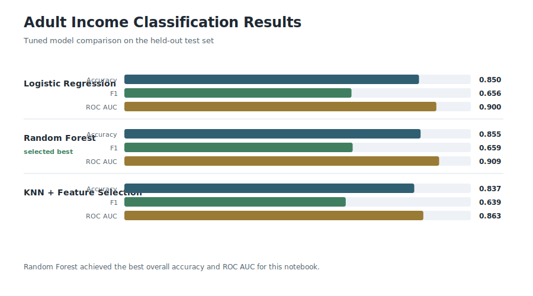
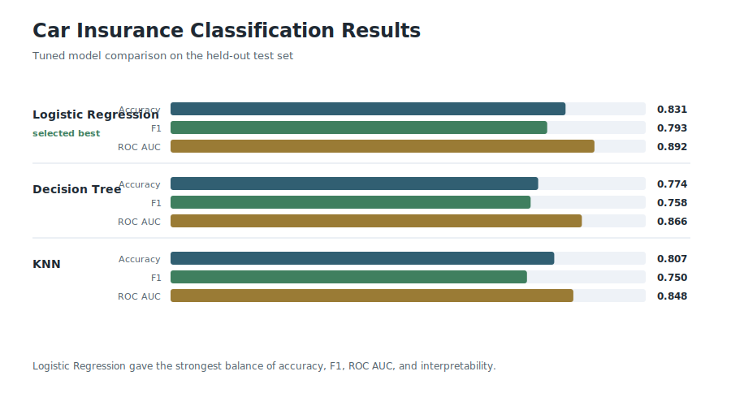
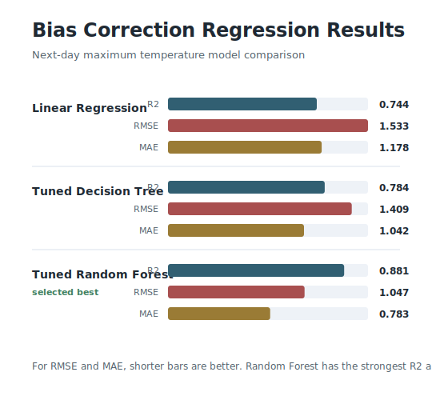
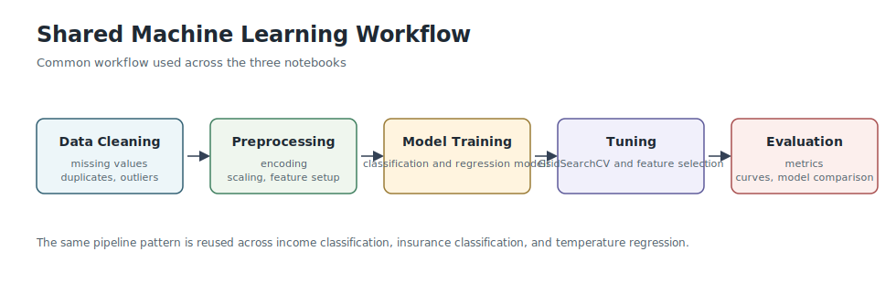

# Model Results

This document summarizes the final model comparisons from the three notebooks.

## Portfolio-Level Summary

| Notebook | Task | Best Model | Main Metric Result | Why It Was Selected |
| --- | --- | --- | --- | --- |
| `adult_income_classification.ipynb` | Binary classification | Tuned Random Forest | Accuracy 0.855, ROC AUC 0.909 | Best overall accuracy and ranking performance among the tested models |
| `car_insurance_classification.ipynb` | Binary classification | Tuned Logistic Regression | Accuracy 0.831, F1 0.793, ROC AUC 0.892 | Strongest balance between predictive performance and interpretability |
| `bias_correction_regression.ipynb` | Regression | Tuned Random Forest Regressor | R2 0.881, RMSE 1.047, MAE 0.783 | Highest R2 and lowest prediction error among the tested regressors |

## Visual Summary

## Adult Income Classification

The Adult Income notebook compares tuned Logistic Regression, Random Forest, and KNN with feature selection.

| Model | Accuracy | Precision | Recall | F1 | ROC AUC |
| --- | ---: | ---: | ---: | ---: | ---: |
| Logistic Regression | 0.850 | 0.737 | 0.591 | 0.656 | 0.900 |
| Random Forest | 0.855 | 0.761 | 0.581 | 0.659 | 0.909 |
| KNN + Feature Selection | 0.837 | 0.684 | 0.599 | 0.639 | 0.863 |

Key takeaway: Random Forest produced the strongest overall result, especially on ROC AUC, while Logistic Regression remained a strong and simpler alternative.

## Car Insurance Classification

The Car Insurance notebook compares tuned Logistic Regression, Decision Tree, and KNN pipelines after cleaning, feature engineering, missing-value handling, and feature selection.

| Model | Accuracy | Precision | Recall | F1 | ROC AUC |
| --- | ---: | ---: | ---: | ---: | ---: |
| Logistic Regression | 0.831 | 0.782 | 0.804 | 0.793 | 0.892 |
| Decision Tree | 0.774 | 0.664 | 0.882 | 0.758 | 0.866 |
| KNN | 0.808 | 0.783 | 0.720 | 0.750 | 0.848 |

Key takeaway: Logistic Regression was the most balanced model. The Decision Tree had the highest recall for buyers, but it traded off too much precision and accuracy.

## Bias Correction Regression

The Bias Correction notebook compares Linear Regression, a tuned Decision Tree, and a tuned Random Forest Regressor for predicting next-day maximum temperature.

| Model | R2 | MSE | RMSE | MAE |
| --- | ---: | ---: | ---: | ---: |
| Linear Regression | 0.744 | 2.350 | 1.533 | 1.178 |
| Tuned Decision Tree | 0.784 | 1.984 | 1.409 | 1.042 |
| Tuned Random Forest | 0.881 | 1.095 | 1.047 | 0.783 |

Key takeaway: Random Forest was the best regression model, explaining roughly 88% of the target variance while keeping average absolute error below one degree.
